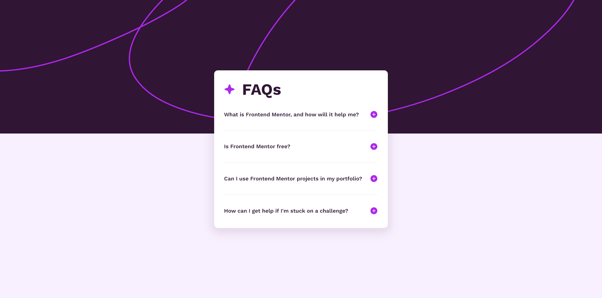

# Frontend Mentor - FAQ accordion solution

This is a solution to the [FAQ accordion challenge on Frontend Mentor](https://www.frontendmentor.io/challenges/faq-accordion-wyfFdeBwBz). Frontend Mentor challenges help you improve your coding skills by building realistic projects. 

## Table of contents

- [Overview](#overview)
  - [The challenge](#the-challenge)
  - [Screenshot](#screenshot)
  - [Links](#links)
- [My process](#my-process)
  - [Built with](#built-with)
- [Author](#author)

## Overview

### The challenge

Users should be able to:

- Hide/Show the answer to a question when the question is clicked
- View the optimal layout for the interface depending on their device's screen size

### Screenshot

### Links

- Solution URL: [Github repository](https://github.com/jpetterson88/frontendMentor/tree/main/faq-accordion-main)
- Live Site URL: [Live Site](https://jpetterson88.github.io/frontendMentor/faq-accordion-main/index.html)

## My process

### Built with

- Semantic HTML5 markup
- CSS custom properties
- Flexbox
- Media Query
- Javascript DOM

## Author

- Github - [My profile](https://github.com/jpetterson88)
- Frontend Mentor - [@jpetterson88](https://www.frontendmentor.io/profile/jpetterson88)
- Linkedin - [My profile](https://www.linkedin.com/in/johnpeterson88/)